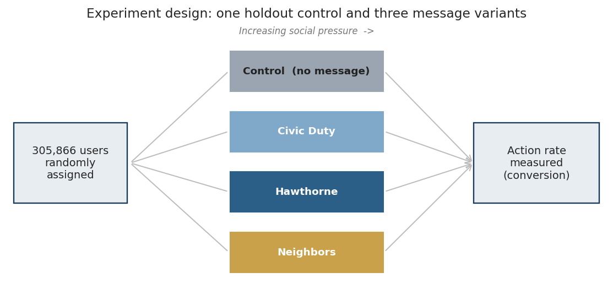
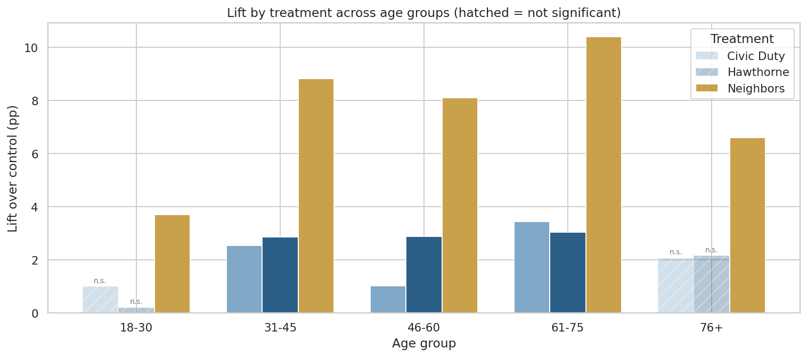

# A/B Testing: Which Message Drives the Most Action?

An A/B testing analysis of a large-scale randomized experiment. Four variants are
compared against a holdout control to measure which one lifts the target action the
most, whether the lift is real, and which users respond best.

The data is a real get-out-the-vote field experiment (Gerber, Green & Larimer,
2008) on 305,866 people. The action being driven is voter turnout. I analyze it as
a product and marketing A/B test, because the methods are identical: a randomized
control, multiple treatment arms, a binary conversion event, and the question of
which message lifts it and for whom. Throughout, turnout is the conversion.



## The data and variables

Registered voters were randomly assigned to a control group or one of three
get-out-the-vote messages of increasing social pressure, then their turnout was
recorded.

- `messages` the variant sent. `Control` got no mail. `Civic Duty` urged the
  recipient to vote. `Hawthorne` told them their turnout was being studied.
  `Neighbors`, the strongest, showed their own and their neighbors' past turnout
  and implied the neighbors would see whether they voted.
- `primary2006` the outcome. Whether the person voted in the 2006 primary. This is
  the conversion event.
- `primary2004` prior behavior. Whether the person voted in the 2004 primary, used
  as the engagement segment.
- `age`, `sex`, `hhsize` voter attributes used for segmentation.

The data comes from an administrative voter file, so covariates are limited to
these fields. Income and similar variables were never collected.

## Headline result

The strongest message (Neighbors) lifts turnout by 8.1 percentage points over
control, 95% CI [7.6, 8.7], a 27% relative gain. All variants are significant, but
effect size separates them.


## Who responds most

The lift is largest among prior voters and peaks in the 31 to 75 age range.


Crossing age with prior turnout pinpoints the strongest cells: prior voters aged
31 to 45 and 61 to 75.


The two milder messages are flat for the youngest and oldest voters. At the age
extremes, only the strong message works.



## Where is the opportunity

Plotting lift (efficiency) against segment size (reach) shows the trade-off. Prior
voters aged 31 to 45 are the most efficient large segment. The 46 to 60 group is
the largest total opportunity.


## Recommendation

Ship the Neighbors message. Prioritize prior voters aged 31 to 45 for efficiency,
or the 46 to 60 group for total volume. Avoid young non-voters, where both the lift
and the milder messages fall flat.

## Methods

Two-proportion z-test computed manually, with confidence intervals. Multi-arm
comparison with a Bonferroni correction. Heterogeneous effects across prior turnout,
age, and their combination. Business impact projection.

## Tech stack

Python, pandas, NumPy, SciPy, matplotlib, seaborn.

## How to run

```
pip install -r requirements.txt
jupyter notebook ab_analysis.ipynb
```

## Reference

Gerber, A. S., Green, D. P., & Larimer, C. W. (2008). Social pressure and voter
turnout: Evidence from a large-scale field experiment. American Political Science
Review, 102(1), 33 to 48.

## Contact

**Tal Jacob**.

- Email: taljacob28@gmail.com
- GitHub: [github.com/taljacob28](https://github.com/taljacob28)
- LinkedIn: [linkedin.com/in/tal-jacob-9753bb256](https://www.linkedin.com/in/tal-jacob-9753bb256)
