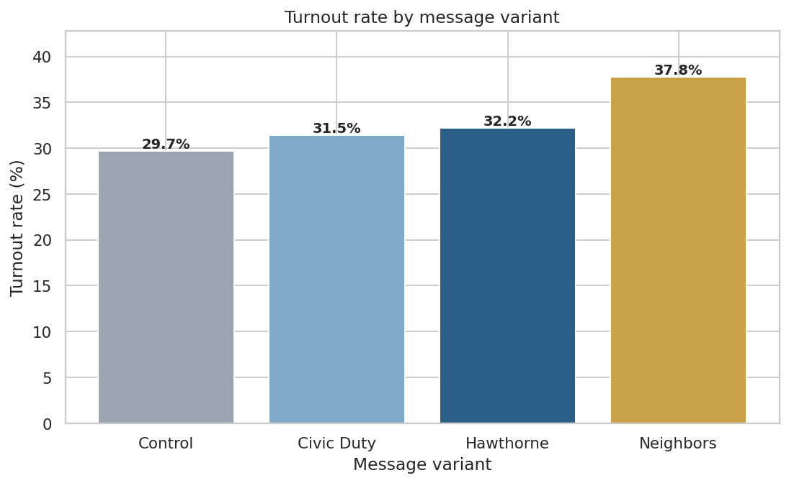
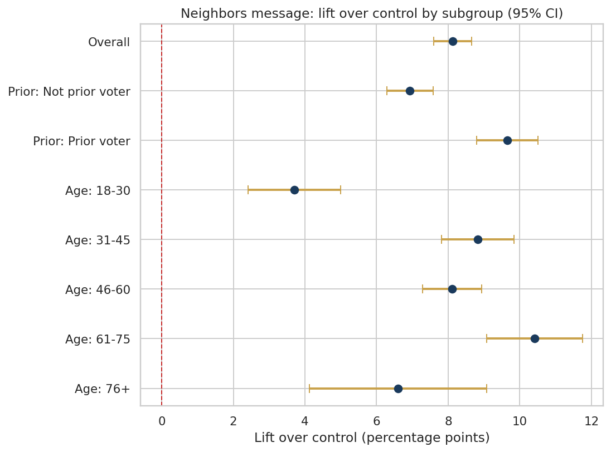
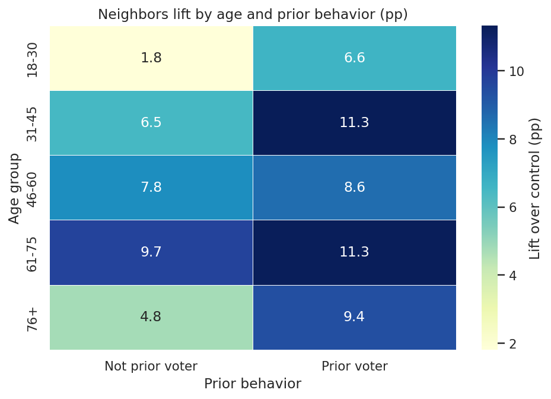
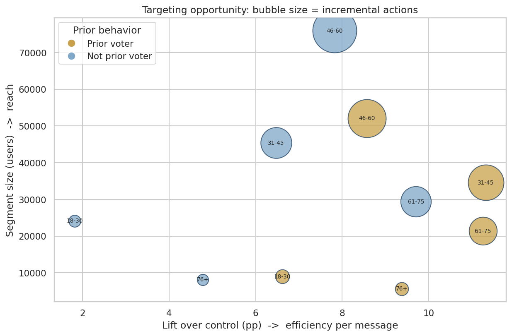

# Messaging Experiment: Estimating Treatment Effects at Scale

An end-to-end analysis of a real randomized field experiment, framed as a product
and marketing A/B test. The project tests which message variant drives the most
action, by how much, and for which users.

## Business question

A campaign sends one of several message variants to users, or no message at all
(holdout control). Which variant lifts the target action the most, is the lift
real or noise, and which users respond best?

## Headline result

The strongest social-pressure message (Neighbors) lifts the action rate by 8.1
percentage points over control, a 27% relative gain.



## Data

Gerber, Green & Larimer (2008), a randomized field experiment on 305,866 people.
Each person was assigned to a control group or one of three messages of increasing
social pressure (Civic Duty, Hawthorne, Neighbors). The outcome is a binary action
taken afterward.

The data is administrative, drawn from an official registration file. Covariates
are limited to registration fields: sex, year of birth, household size, and prior
behavior. Income and similar fields are not present because they were never
collected. This limitation is documented in the notebook.

## Methods

- Data preparation, feature engineering, and a data-quality check
- Two-proportion z-test, computed manually, with confidence intervals
- Multi-arm comparison with a Bonferroni correction
- Heterogeneous treatment effects: one-way, two-way (age x prior behavior), and
  across all treatments
- Business impact projection and a targeting opportunity map (lift vs reach)

## Who responds most

The lift is largest among already-active users and peaks in the 31 to 75 age range.



Crossing age with prior behavior pinpoints the strongest cells: active users aged
31 to 45 and 61 to 75. The weakest is young dormant users.



## Where is the opportunity

Plotting each segment by lift (efficiency) against size (reach) shows the trade-off.
Active users aged 31 to 45 are the most efficient large segment. The 46 to 60 group
is the largest total opportunity, since its size outweighs a slightly smaller lift.



## Key findings

- The Neighbors message lifts the action rate by 8.1 percentage points over
  control, 95% CI [7.6, 8.7]. It wins in every subgroup tested.
- All three messages are significant, but effect size separates them. Civic Duty
  lifts only 1.8 points.
- At the youngest and oldest ages, only the strong message produces a significant
  lift. The milder messages are flat there.
- The strong message amplifies with prior engagement, while the gentle reminder is
  flat across engagement.
- At equal cost per message, Neighbors produces about three times the incremental
  actions of the next best variant.

## Recommendation

Ship the Neighbors message. Under a limited budget, prioritize active users aged
31 to 45 for efficiency. To maximize total incremental actions, lead with the
46 to 60 segment. Avoid young dormant users, where both the lift and the milder
messages fall flat. The milder variants are significant but small.

## Tech stack

Python, pandas, NumPy, SciPy, matplotlib, seaborn.

## Repository structure

```
messaging-experiment-ab/
├── data/
│   └── social_pressure_experiment.csv
├── images/
│   ├── action_rate_by_variant.png
│   ├── lift_forest_plot.png
│   ├── lift_heatmap_age_prior.png
│   └── targeting_opportunity_map.png
├── ab_analysis.ipynb
├── requirements.txt
└── README.md
```

## How to run

```
pip install -r requirements.txt
jupyter notebook ab_analysis.ipynb
```

Run the cells in order from top to bottom.

## Reference

Gerber, A. S., Green, D. P., & Larimer, C. W. (2008). Social pressure and voter
turnout: Evidence from a large-scale field experiment. American Political Science
Review, 102(1), 33 to 48.
